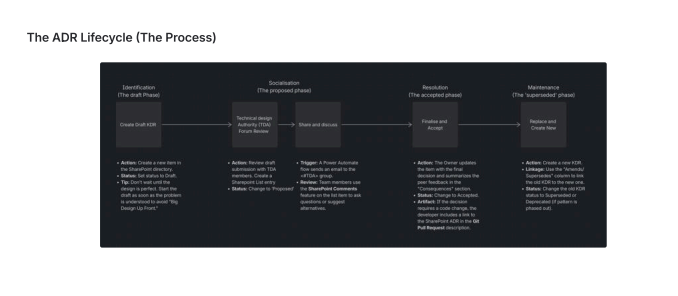

# KDR 001: Adoption of Lightweight ADRs

**Status:**

**Proposed:**

**Amends/Supersedes:**

**N/A**

## Context and Problem Statement

As the DBB evolves, we face several challenges regarding technical alignment and historical
context:
    - "Tribal Knowledge": Critical design decisions are often made in team spaces or private
    chats, private meetings, or hallway conversations, making them invisible to new hires or other
    teams.
    - Decision Regret: Without documentation, we often revisit the same technical debates every
    six months because we forgot the original constraints.
    - Onboarding Friction: New engineers struggle to understand why the system is built a certain
    way, leading to accidental technical debt.

We need a lightweight, version-controlled way to document the "why" behind our architecture,
not just the "what." This prevents "architectural drift," where the system evolves without a
cohesive vision.

## Proposed Decision

We will adopt SharePoint Directory and Lists as the primary source of truth for Architecture
Decision Records, emphasising the following principles:

- **The "Why," Not the "How":** Focus on the rationale and the trade-offs considered (the
"Context" and "Consequences" sections).
- **The Last Responsible Moment:** We will not write ADRs for every minor detail. We will write
them when a decision must be made to allow work to proceed, but not so early that we lack
the data to make an informed choice.
  - **Status Lifecycle:** ADRs are living documents. We will use the following statuses:
  - **Draft:** ADR created.
  - **Proposed:** Open for discussion post ADA review.
  - **Accepted:** The current path forward.
  - **Superseded:** Used when a later ADR replaces this decision (must link to the new ADR).
  - **Deprecated:** When the feature or pattern is being phased out.

  

## Rationale and Alternatives considered

- **SharePoint List Only:** This was the original process but was found insufficient for rich content
and complex technical rationale.

- **Git Repository Storage:** Traditional for technical teams but often creates a barrier for non-
technical stakeholders (Product, Compliance, Security) who need visibility into decisions.

## Consequences and Trade-Offs

### Pros

- **Reduced Cognitive Load:** Developers don't have to guess why a specific library or pattern
was used; the "thought process" is transparent.
- **Knowledge Persistence:** Even if a lead developer leaves, their rationale for the system's
"bones" remains.
- **Visibility:** Decisions are transparent to the entire company, not just those with CLI access.
- **Searchability:** SharePoint’s native search and filtering (by Status or Date) are superior to
searching through flat Markdown files.
- **Low Friction:** Stakeholders can leave comments and feedback directly on the list item without
needing to understand Pull Request workflows

### Cons

- **Analysis Paralysis:** There is a risk of over-analysing small decisions. We must empower
teams to distinguish between "Architectural" decisions and "Implementation" details.
- **Repository Bloat:** If not managed, the `/docs` folder can become cluttered. (Mitigated by
clear numbering: `0001-use-postgresql.md` ).

## TDA Approval & Sign-off

**TDA Decision:** [Approved / Needs Revision / Rejected]

**Conditions of Approval:** [List any specific caveats the TDA insists upon]

**Approvers:** [List Names/Roles of TDA members present]
