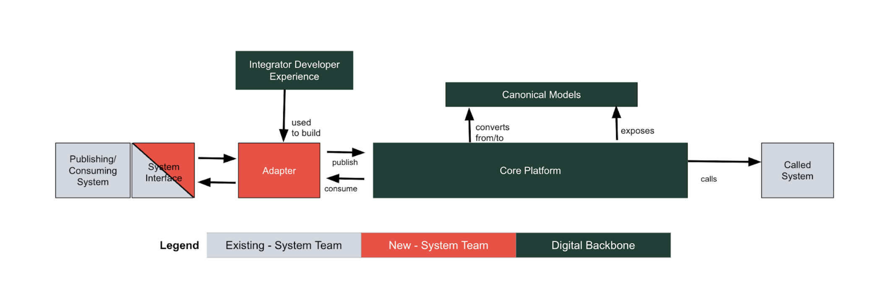

# Digital Backbone Feature Specification

## Introduction

The Digital Backbone is the Howden integration platform for enterprise business applications that enables greater agility for the business and significantly reduces integration complexity for IT teams.

The Digital Backbone is comprised of the following components:

- Canonical Data Models - The Digital Backbone defines Howden-wide canonical data models that greatly reduce the need for systems to understand the interfaces of the multitude of other systems with which they need to integrate.  These are used for both synchronous and asynchronous style model interactions.
- Core Platform - The Digital Backbone provides the reliable and secure processing of synchronous and asynchronous requests by client systems.
- Integrator Developer Experience - The Digital Backbone enables a predictable and accelerated experience for developers when building adapters between systems and the Digital Backbone.

Client systems integrate via the Digital Backbone and use specialized capabilities to communicate with it.

- Client System - Howden enterprise system that needs to publish or consume data from another system, synchronously or asynchronously
- Adapter - translates between canonical data models and those of the system interface
- System Interface - Interface used to communicate between the publishing/consuming system and the adapter

## Canonical Data Models

The Digital Backbone defines internally canonical data models for synchronous and asynchronous communications between Howden enterprise systems.

### Model Fidelity

- Canonical data models are centered around business entities; for example, Opportunity or Policy.
- For each business entity, there can be defined one or more event/operation models related to those business entities, from the following list of stereotypical models:
  - Async models
    - “Created” - a new instance of this entity was created
    - “Updated” - data within an existing instance of this entity was modified
    - “Deleted”  - an existing instance of this entity was deleted Synch models
    - “Create” - create a new instance of this entity
    - “Get” - get one or more existing instance(s) of this entity
    - “Replace” - fully replace an existing instance of this entity
    - “Update” - partially update an existing instance of this entity
    - “Delete” - delete an existing instance of this entity
  - The above stereotypical models are the default approach for the Digital Backbone, but does not preclude different levels of granularity (i.e., “Opportunity Status Updated”) on a case-by-case basis.

### Version Evolvability

The creation and changing of canonical data models is performed with no coding required by Digital Backbone platform developers.

### Multiple Version Support

Simultaneously supports up to two versions of the same canonical data model for up to 90 days.

### Canonical Data Models (Current)

Current models are those that are in production.
    - Opportunity Status Change

### Canonical Data Models (Planned)

Current models are those that are in development.
    - Trial Balance Created
    - Create Party
    - Update Party
    - Party Updated
    - Get Party

## Core Platform

### Client Registration

- Provides a web interface for the registration of client systems for the secure and observable publication/consumption of one or more canonical data models
- New and updated client systems registrations are performed without coding or system downtime.  

### Asynchronous Message Receipt

- Confirms receipt of validated canonical data model messages published by client systems.

### Asynchronous Message Delivery

- Delivers messages published by client systems, only once and in the order received, to client systems that have registered to receive them.
- Clients register for message delivery by message type and as well as pre-approved filters to ensure they can limit their access and exposure to data.
- Clients can indicate a maximum per time period message delivery rate
- Unless limited by delivery rate, asynchronous message receipt from a publishing system to delivery to a consuming system takes no longer than 10 seconds.

### Synchronous Call Processing

- Proxies synchronous API calls to Howden enterprise systems using a canonical data model as both the request and response format.
- Call receipt to response delivery, including time to call the internal system, takes no longer than 500 milliseconds.

### Canonical Data Model Framework

- A framework used by platform developers to quickly build and update canonical data models.  A new canonical data model can be defined, tested and rolled out within four weeks.

### Processing Monitoring and Logging

- Client system request processing time and throughput statistics are tracked to maintain acceptable system performance.
- Processing logs across the Digital Backbone’s various components are centrally maintained to enable error tracing across the system.

### Role-Based Authorization

- Client system calls to the Digital Backbone are authorized using roles corresponding to individual canonical data models.

### Resilient to Hosting Infrastructure Failures

- When a failure of the primary hosting infrastructure has been detected, system operations will failover to secondary hosting infrastructure within 5 minutes of being detected.
- Within five minutes of the primary hosting infrastructure being restored, operations will resume in the primary hosting.
- There will be no loss of client system requests or monitoring/logging data during disaster recovery failover and restoration.

### Limited Planned Downtime

- Updates to system configuration and code will incur no more than 43 minutes of downtime per month, equivalent to 99.99% availability, during system operations time, with no single outage lasting more than 10 minutes.

### Configuration-Driven

- The addition and updating/versioning of canonical data models is done through configuration with zero planned downtime required.
- The addition, updating and removal of client systems registrations is done through configuration with zero planned downtime required.

### No Business Logic

- Processing of requests from client systems will not support enrichment or execution of custom business logic.  This will take place in adapters.

## Integrator Developer Experience

### Canonical Data Model and API Endpoint Catalog

- A browsable and searchable online catalog of the current and planned canonical data models and their versions.

### Canonical Model Dictionary

- Detailed definition of each canonical model, including versions, sufficient for building adapters.

### Adapter Scaffolding

- Framework for building new adapters that allows adapter developers to focus on transformation from/to canonical models.

### Testing Services

- Non-production environment of the Core Platform used to test adapters during development.
- Mock API endpoints for static testing

### Integrator’s Guide

- Online documentation that guides adapter developers through the processing of integrating with the Digital Backbone.
- Testing and environment strategy

### Developer Support Forum

- An online interactive forum between adapter developers and Digital Backbone platform developers.
