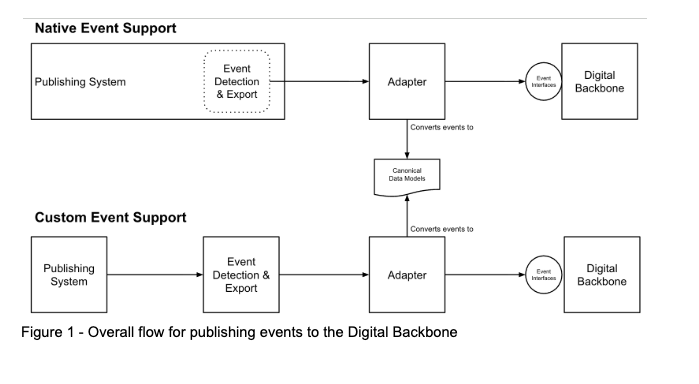

# How the Digital Backbone works

The Digital Backbone is Howden’s integration platform that reduces the complexity of integrating systems across the enterprise.  The traditional challenge with integration is that each system needs to understand the data format and technical interface of every other system.  The Digital Backbone simplifies this by standardizing both data formats and technical interfaces.  It supports two distinct types of system integration:

## Asynchronous data events

Systems publish events about changes in their data.  Those events can be consumed by systems who are interested in those changes.  The Digital Backbone provides interfaces for event publishers that are of varied types and follow a specified schema.  These are called canonical data models.  In most cases, a publishing system’s data is not in the canonical data model format.  Other systems register with the Digital Backbone to have events of specific types delivered to them.

### Publishing Systems

Any system that stores one or more data entity can be a publishing system.  Examples of these systems are Howden Client, Applied Epic, Open Twins and Unit 4.

### Event Detection and Exporting

In order for systems to publish events, changes to their data must be detected and exported.  Some systems will do this has a built-in capability.  Others do not have this built-in; therefore, this must be done as a custom solution.  A common approach to custom Event Detection and Exporting is Change-Data-Capture.  This technology identifies changes at the database level and exports those changes into a specified location and in a structured format that mimics the database schema from which it came.

### Canonical Data Models

Canonical data models are made up of event types and their specified schemas.  Generally, events are a combination of a data entity (Opportunity or Policy for example) and a past tense verb describing what has happened wih the entity.   The verbs are generally:

- Created - a new instance of the entity was created by the system
- Changed - one or more fields in an existing instance of the entity were changed
- Deleted - an existing instance of the entity was deleted

For example, if a new Opportunity was created in Howden Client, it would publish an event named Opportunity Created with the relevant data needed by consuming systems.

### Adapters

The Digital Backbone requires events to be published in canonical data model format.  Because Event Detection and Exporting creates events in system-specific format, they must be “adapted” into the canonical data model format required by the Digital Backbone’s event interface.  This is done by a purpose-built Adapter component.  An Adapter accepts an event in a system’s schema and returns the event expressed in canonical data model format.  In addition to adapting the event format, an adapter may also send the event to the Digital Backbone’s event interface.

### Event Interfaces

Events are published to the Digital Backbone using an event interface.  This is a REST over HTTP endpoint that accepts inputs in canonical data model format.

## Synchronous API calls

Systems expose their operations in a standardized interface that other systems may call.  More information coming soon!
